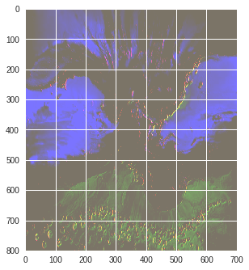
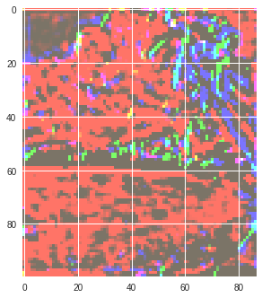
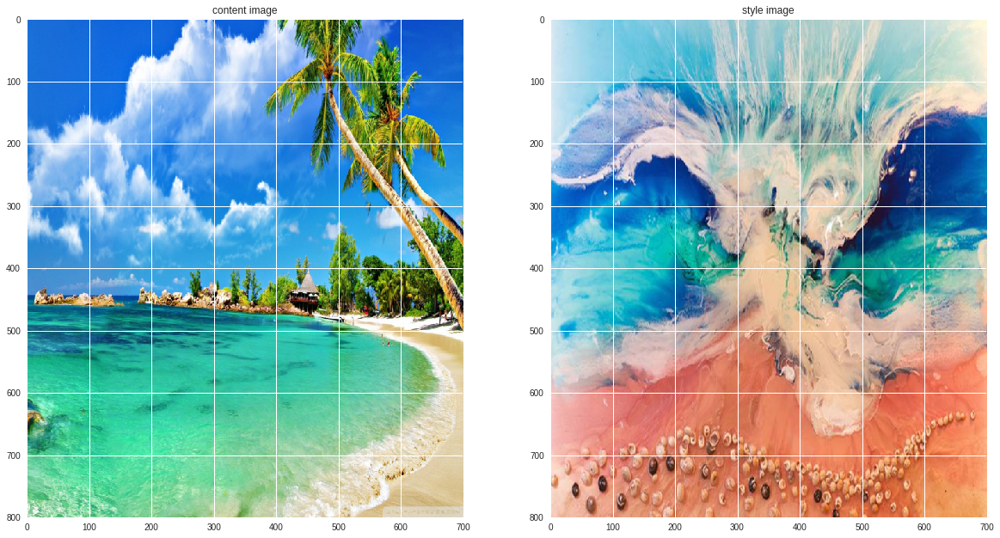
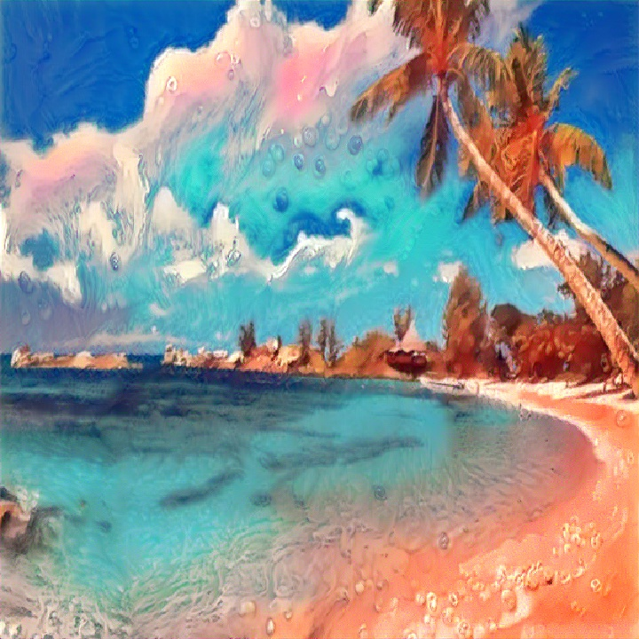
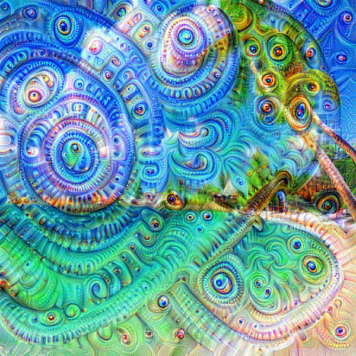
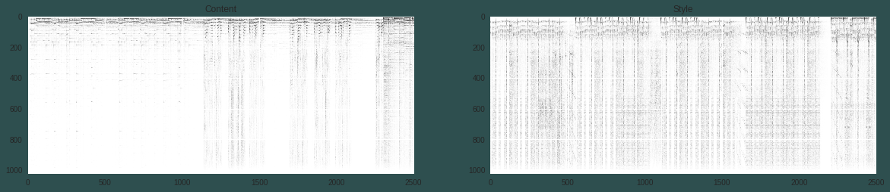
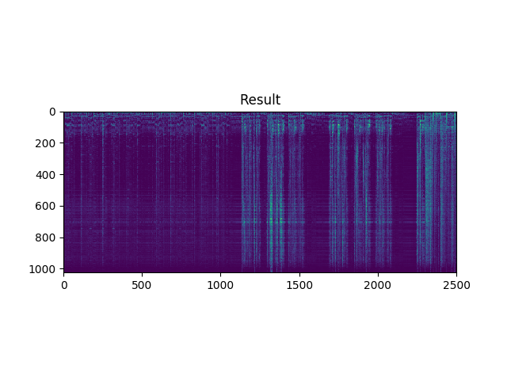

# [Session 1 & 2](Session-1 and 2)

#### Agenda:

1. Introduction to Python
2. Introduction to Numpy
3. Introduction to Matplotlib
4. Machine Learning Basics

      * What are Algorithms

      * Bias vs Variance trade off

      * Underfitting, Overfitting

      * Hyperparameters and Validation Sets

      * Gradient Descents

      * Linear Regression

      * Logistic Regression
5. Deep Learning Basics 

      * Neural Networks

      * Backpropagation

      * Activation and Loss Function

      * Optimizers
6. Building Image Classification Model using Keras and Pytorch (MNIST Dataset).
7. Flask Deployment on Local System

# [Session3](Session3)

**Agenda:**

Convolution and its concepts

1. Concept of Convolution
2. Kernel
3. Feature map
4. Stride
5. Padding
6. Max pooling
7. Receptive field
8. Loss functions(Maximum Likelihood,Cross Entropy)

Model Deployment 

1. CNN Model Deployment on the Flask Web Framework.
2. Inferencing the deployed model in Real-time

# [Session4](Session4)

#### Agenda:
1. Weight Initialization Schemes
2. Data Augmentation
3. Regularization and Normalization
   1. L1 Regularization
   2. L2 Regularization
   3. Dropout
   4. Label Smoothing
   5. Batch Normalization
   6. Layer Normalization (Brief)
4. Advance CNN Architectures
   4. LeNet
   2. AlexNet
   3. ZfNet
   4. Vgg
   5. ResNet
   6. ResNet Wide
   7. DenseNet 
   8. MobileNet
   9. Inception v1
   10. Inception v2 and v3
5. [Dogs vs Cats Classification Kaggle Kernel](Session4/Pytorch_cat_vs_dog.ipynb)
6. [Dogs vs Cats Classification Colab version](Session4/Pytorch_Dog_vs_Cat_colab.ipynb)
7. [Dogs vs Cats Classification Keras Version](Session4/Kaggle_Cat_vs_Dogs_vgg19.ipynb)

# [Session5](Session5)

1. Transfer Learning on ResNet50 Model
2. Creating Your own Dataset from google images(Indian Birds)
3. Transfer Learning Theory and Implementation
4. Lr Scheduler in pytorch
   1. CosineAnnealingLR
   2. LinearScheduler
   3. ExponentialScheduler
   4. CosineScheduler

5. Visualizing The prediction
6. Faster Convergence methodologies
   1. LrFinder Algorithm
   2. SGD with Warm Restarts
   3. One Cycle Policy

7. Model Fine Tuning by using the above techniques
8. Getting Accuracy Results Equivalent to Fast.ai

# [Session6](Session6)

## Feature Map Visualization

## Style Transfer

## Deep Dream

## Neural Style Transfer

